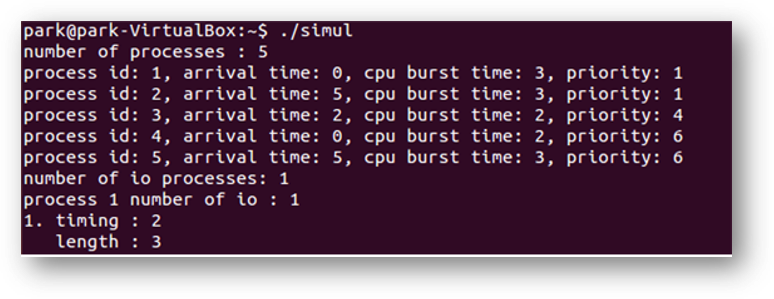
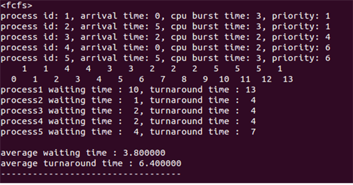
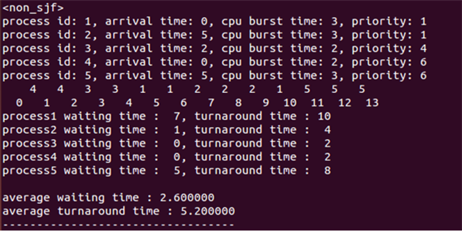

# cpu-scheduler
## 프로젝트 소개
  - CPU 스케줄링이란
    * 메모리상의 여러 개의 프로세스를 순차적으로 실행하기 위하여 운영체제가 제공하는 스케줄링 기능입니다.
  - FCFS, Round Robin 알고리즘 등을 C언어로 구현하였습니다.
  
## 개발 환경
  - Visual Studio를 이용한 C programming
  
## 실행 화면

- 프로세스의 수와 io process의 횟수와 timing, length를 설정하는 화면입니다.

- 생성된 프로세스를 기반으로 fcfs(first come first served)를 수행한 화면입니다.
- 아래에 프로세스 별로 waiting time과 turnaround time이 출력되고 맨 아래쪽에 average waiting time, average turnaround time이 출력됩니다.

- 생성된 프로세스를 기반으로 Nonpreemtive-sjf(Shortest job first)를 수행한 화면입니다.
- 아래에 프로세스 별로 waiting time과 turnaround time이 출력되고 맨 아래쪽에 average waiting time, average turnaround time이 출력됩니다.

